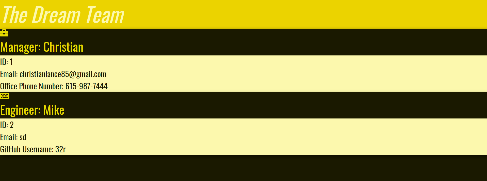

# Team-Profile-Engine---Employee-Summary
This is a repository for the Vanderbilt Coding Bootcamp Homework 10
By | Christian Lance

## Purpose
This is a GitHub repository for a team profile generator application. 

## User Story
AS A manager
I WANT to generate a profile for my team.
SO THAT I can establish a heirarchy amongst them.

## Screenshot of Completed Application

## Installation

With GitHub account, clone or download repository using link. 

## Usage

This will application will assist users with building out a profile
for their work team.